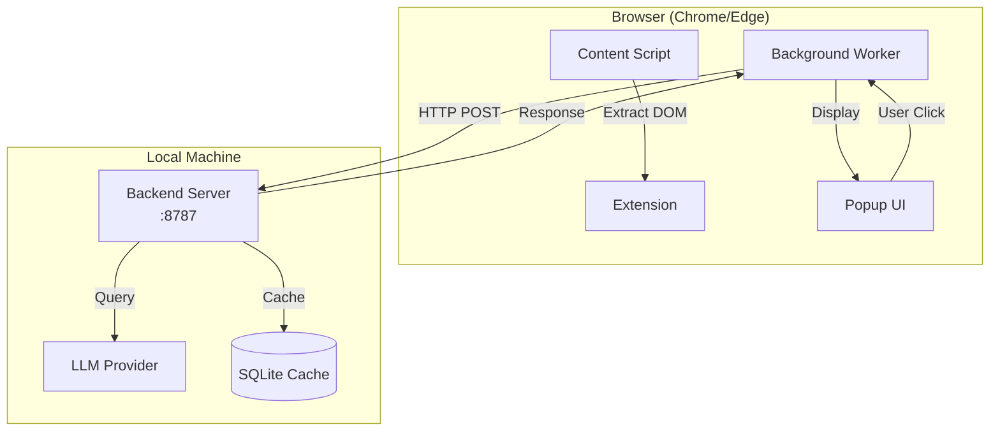
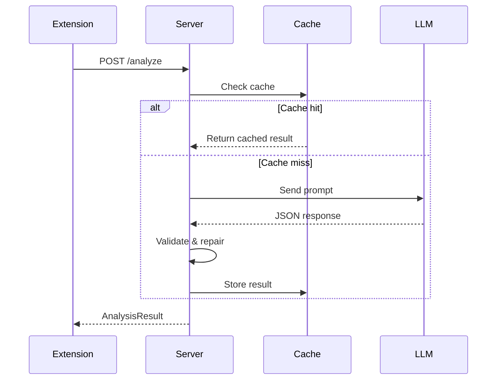

# JobReviewAssistant Architecture

## System Overview

JobReviewAssistant is a local-first, user-triggered job posting analysis system consisting of two independent components:



## Component Details

### 1. Browser Extension

The extension is built for Chromium-based browsers (Chrome, Edge) using Manifest V3.

#### Files

| File | Purpose |
|------|---------|
| `manifest.json` | Extension configuration and permissions |
| `content.js` | DOM extraction from job posting pages |
| `background.js` | Network proxy to backend |
| `popup.html/js/css` | User interface |

#### Data Flow

1. User clicks extension icon
2. Popup sends message to content script
3. Content script extracts job data from DOM
4. Background worker sends data to backend
5. Results displayed in popup

### 2. Backend Server

Python-based analysis server running on localhost:8787.

#### Files

| File | Purpose |
|------|---------|
| `server.py` | FastAPI application and endpoints |
| `analyzer.py` | LLM integration and output parsing |
| `prompt.py` | Prompt templates and evaluation rubric |
| `schema.py` | Pydantic models for validation |
| `storage.py` | SQLite caching layer |

#### Analysis Pipeline



## Security Model

### Extension Security

- Uses `activeTab` permission (minimal)
- No persistent data storage
- No credential handling
- No autonomous execution

### Backend Security

- Runs only on localhost
- No external network exposure
- No credential storage
- API keys via environment only

## Data Schema

### Input (JobInput)

```json
{
  "url": "string",
  "title": "string",
  "company": "string",
  "raw_text": "string"
}
```

### Output (AnalysisResult)

```json
{
  "role_type": "string",
  "difficulty": 1-5,
  "difficulty_rationale": ["string"],
  "tech_stack": {
    "languages": ["string"],
    "frameworks": ["string"],
    "tools": ["string"]
  },
  "responsibilities_summary": ["string"],
  "requirements_summary": ["string"],
  "resume_value": 1-5,
  "risk_flags": [
    {"flag": "string", "evidence": "string"}
  ],
  "overall_notes": "string"
}
```

## LLM Provider Configuration

The analyzer supports multiple LLM providers:

| Provider | Environment Variable | Default Model |
|----------|---------------------|---------------|
| OpenAI | `OPENAI_API_KEY` | gpt-4o-mini |
| Anthropic | `ANTHROPIC_API_KEY` | claude-3-haiku |
| Ollama | `OLLAMA_BASE_URL` | llama3.2 |
| Mock | (none) | Heuristic placeholder |

Set `LLM_PROVIDER` environment variable to switch providers.

## Caching Strategy

- Primary key: Content hash (SHA-256 of raw_text)
- Secondary key: URL hash
- Invalidation: Prompt version change
- Storage: SQLite file (`cache.db`)

## Development Setup

```bash
# Backend
cd backend
python -m venv venv
source venv/bin/activate  # or venv\Scripts\activate on Windows
pip install -r requirements.txt
python server.py

# Extension
1. Open chrome://extensions
2. Enable "Developer mode"
3. Click "Load unpacked"
4. Select the extension/ directory
```
